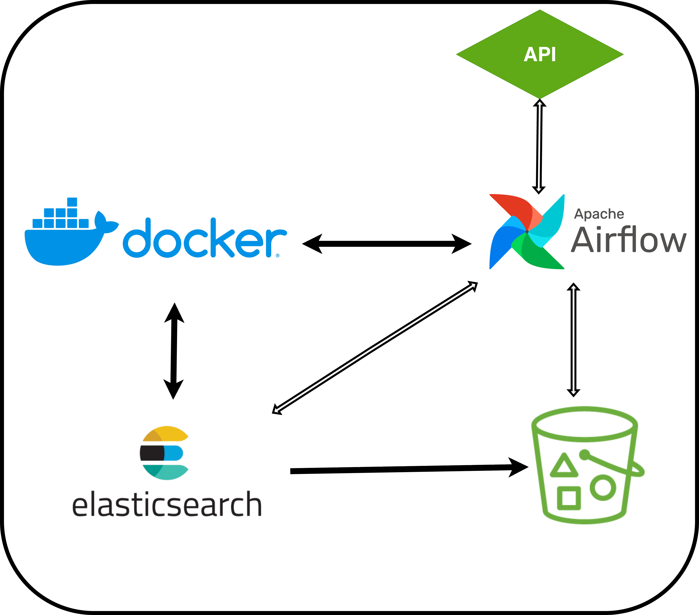

# Airflow Project :

This end-to-end data pipeline fetches real-time tweets mentioning stock tickers using the Sahamyab API, processes them with Apache Airflow, indexes the structured data into Elasticsearch for querying specific words in tweets, and persists both raw and processed data in JSON and Parquet formats to ArvanCloud S3 buckets. The entire stack is fully containerized with Docker and orchestrated via Airflow DAGs for reliability, scheduling, and monitoring.

  
  

  

  Dags list :
  

  
    

